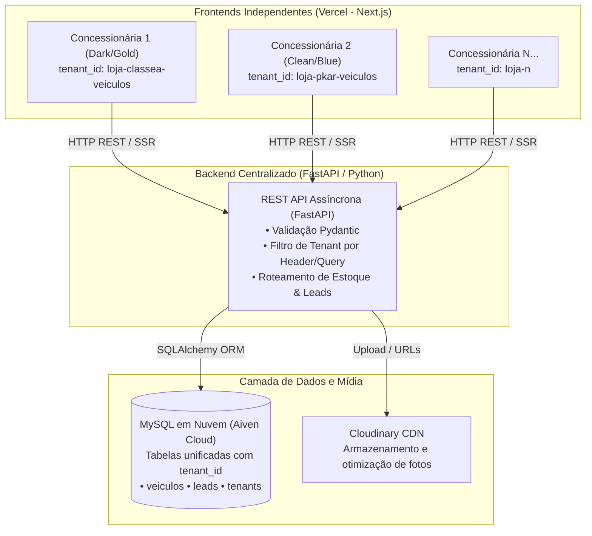

# 🚗 SaaS Multi-Tenant para Concessionárias de Veículos

> Plataforma completa de alta performance para gestão e vitrine de estoques automotivos, operando em arquitetura **Multi-Tenant** com **Backend Centralizado** em Python (FastAPI) e múltiplos frontends independentes em **Next.js / React**.

---

## 🌐 Demonstrações Online (Deploy Vercel)

Acesse os sites em produção criados sobre a mesma infraestrutura e banco de dados, ilustrando a flexibilidade de temas, marcas e públicos:

| Concessionária | Perfil & Identidade Visual | Link de Demonstração |
| :--- | :--- | :--- |
| **Concessionária 1** | **Seminovos Premium & Luxo**<br>Tema *Dark / Gold*, foco em marcas de alto padrão (Porsche, BMW, Mercedes-Benz, Audi, Land Rover, Ducati, etc.). | 🔗 [concessionaria1-olive.vercel.app](https://concessionaria1-olive.vercel.app/) |
| **Concessionária 2** | **Seminovos Populares, Sedãs, SUVs & Motos**<br>Tema *Clean / Blue*, foco em alto volume de vendas (Chevrolet, Hyundai, Toyota, Honda, Jeep, Yamaha, etc.). | 🔗 [concessionaria2-orcin.vercel.app](https://concessionaria2-orcin.vercel.app/) |

*(Nota: Os dados, fotos e valores exibidos são gerados para demonstração de portfólio, preservando dados reais e segredos comerciais).*

---

## 🏗️ Arquitetura do Sistema (Multi-Tenancy)

O grande diferencial deste projeto é a arquitetura **Multi-Tenant com Banco Compartilhado e Isolamento Lógico**: uma única infraestrutura de backend atende dezenas de lojas simultaneamente, reduzindo drasticamente custos de hospedagem e simplificando a manutenção e deploy.



### Como a Mágica Acontece:
1. Cada frontend possui sua própria variável de ambiente `NEXT_PUBLIC_TENANT_ID`.
2. Ao realizar qualquer requisição (listagem de estoque, filtros, busca por ID, envio de proposta), o frontend informa sua identidade.
3. O backend em **FastAPI** aplica automaticamente os filtros de segurança e isolamento lógico (`WHERE tenant_id = :tenant_id`), garantindo que uma loja nunca veja nem altere dados da outra.
4. Para criar uma nova concessionária na plataforma, basta cadastrar um novo registro na tabela `tenants` e publicar um novo frontend apontando para o mesmo backend.

---

## ✨ Principais Funcionalidades

### 🛒 Para o Comprador (Experiência do Cliente)
- **Filtros Dinâmicos em Tempo Real:** Pesquisa refinada por Tipo (`Carro` e `Moto`), Marca, Faixa de Preço (com seletor *Range Slider* interativo), Ano de Fabricação e Acessórios.
- **Comparativo Tabela FIPE & Ofertas:** Cálculo dinâmico de economia exibindo o preço de tabela FIPE (`preco_fipe`) comparado ao valor promocional (`preco_promocional`), destacando as melhores oportunidades.
- **Galeria de Fotos com Miniaturas:** Carrossel responsivo de fotos do veículo com suporte a visualização ampliada e fallback automático para imagens de contingência.
- **Simulador de Financiamento & Entrada:** O cliente simula o valor de entrada e as parcelas estimadas diretamente na página do veículo.
- **Conversão Direta para WhatsApp com Pré-preenchimento:**
  - O clique no botão de contato gera uma mensagem formatada contendo o nome do cliente, carro de interesse, valor anunciado e proposta de entrada.
  - Ao mesmo tempo, o sistema armazena o **Lead no CRM interno** da loja para controle dos vendedores.
- **SEO & Compartilhamento Social Otimizado (Open Graph):** Cada veículo possui metatags dinâmicas com título atraente, foto em alta resolução e resumo de opcionais, gerando *cards* perfeitos no WhatsApp, Telegram, Facebook e LinkedIn.
- **Sistema de Veículos Favoritos:** Persistência no navegador (`LocalStorage`) permitindo ao cliente salvar e comparar seus veículos preferidos.

### 💼 Para a Concessionária (Painel Administrativo)
- **Gestão Completa de Inventário (CRUD):** Cadastro, edição, precificação, definição de promoções e controle de status (`disponível`, `vendido`, `reservado`).
- **CRM de Leads Integrado:** Listagem em tempo real de contatos recebidos com telefone, carro de interesse, valor de entrada proposto e status de atendimento (`novo`, `em negociação`, `concluído`).
- **Métricas de Engajamento:** Contador automático de visualizações por veículo (`visualizacoes`) e logs temporais de acessos.

---

## 🛠️ Stack Tecnológica

### Frontend
- **Framework:** [Next.js](https://nextjs.org/) (App Router, Server-Side Rendering e Static Generation)
- **Biblioteca Base:** [React](https://react.dev/) & [TypeScript](https://www.typescriptlang.org/)
- **Estilização:** [Tailwind CSS](https://tailwindcss.com/) & CSS Modules para temas ultra-personalizados
- **Animações:** [Framer Motion](https://www.framer.com/motion/)
- **Ícones:** [Lucide React](https://lucide.dev/)
- **Analytics:** [@vercel/analytics](https://vercel.com/analytics)
- **Deploy & CI/CD:** [Vercel](https://vercel.com/)

### Backend
- **Linguagem:** [Python 3](https://www.python.org/)
- **Framework:** [FastAPI](https://fastapi.tiangolo.com/) (Arquitetura assíncrona ASGI de alta concorrência)
- **ORM & Banco:** [SQLAlchemy](https://www.sqlalchemy.org/) com driver PyMySQL
- **Validação de Schemas:** [Pydantic](https://docs.pydantic.dev/)
- **Servidor:** Uvicorn

### Banco de Dados & Serviços Cloud
- **Banco de Dados:** [MySQL](https://www.mysql.com/) hospedado no [Aiven Cloud](https://aiven.io/) com conexões seguras SSL
- **Mídia & CDN:** [Cloudinary](https://cloudinary.com/) (armazenamento otimizado de imagens e entrega responsiva)

---

## 📂 Estrutura do Repositório

```text
├── database.py                 # Conexão e sessão com o banco relacional (MySQL / Aiven)
├── models.py                   # Modelos ORM (Tenant, Veiculo, FotoVeiculo, Lead, VeiculoViewLog)
├── schemas.py                  # Schemas de validação e serialização Pydantic
├── main.py                     # API FastAPI com rotas de estoque, filtros, upload e leads
├── populate_showcase.py        # Script automatizado de população de veículos para demonstração
├── front-classea-veiculos/     # Frontend da Concessionária 1 (Next.js - Tema Dark/Gold)
│   ├── src/app/                # Rotas da aplicação (Home, /veiculos, /carro/[id], /admin)
│   ├── src/components/         # Componentes reutilizáveis (Header, Footer, Gallery, SearchForm)
│   └── tailwind.config.ts      # Customização de cores e tema Dark Premium
├── front-pkar-veiculos/        # Frontend da Concessionária 2 (Next.js - Tema Clean/Blue)
│   ├── src/app/                # Rotas da aplicação
│   ├── src/components/         # Componentes compartilhados com estilização adaptada
│   └── tailwind.config.ts      # Customização de cores e tema Moderno
└── README.md                   # Documentação detalhada da solução
```

---

## 🎯 Impacto Comercial e Benefícios da Solução

1. **Escalabilidade com Custo Quase Zero:** Uma única instância de backend e um banco de dados hospedam o inventário de dezenas de lojas, sem necessidade de alugar novos servidores para cada cliente que entra.
2. **Identidade Própria para Cada Cliente:** Cada lojista tem seu domínio próprio, cores personalizadas e número de WhatsApp, sem parecer um "portal genérico de terceiros".
3. **Conversão Focada em Vendas:** Menos cliques entre a busca do carro e o contato com o vendedor no WhatsApp.
4. **Facilidade de Manutenção:** Qualquer melhoria em regras de negócio, cálculo de FIPE ou segurança é atualizada em um único lugar no backend e beneficia todas as lojas imediatamente.

---

*Projeto desenvolvido com foco em arquitetura limpa, alta performance, escalabilidade e valor real de negócio.*
